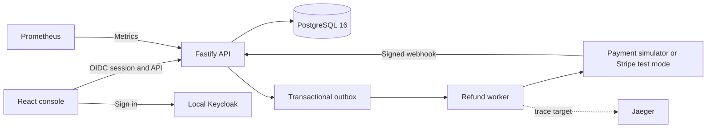

# Internal Tools Foundation and Refunds Console

This repository contains a local prototype for internal tools. The Foundation supplies shared identity, access checks, approvals, audit events, idempotency, an outbox, and UI components. The Refunds Console is the reference tool.

This prototype uses synthetic data. It is not ready for production use.

## Architecture



The API checks permissions before it runs protected routes. It rejects a route that has no permission declaration. PostgreSQL locks a payment row before it reserves a refund amount. The worker uses an idempotency key when it calls the provider.

## Start the local stack

Requirements: Docker Compose and Node.js 22.

1. Copy `.env.example` to `.env` if you need to change a local value.
2. Run `docker compose up -d --build --wait`.
3. Open `http://localhost:5173`.
4. Sign in with one of the local accounts below.

Compose starts PostgreSQL, Keycloak, the payment simulator, the API, the worker, the web console, Jaeger, and Prometheus. The API applies the SQL migration and loads 100,000 synthetic charges with demo refunds and one reconciliation exception. Compose stays running until you stop it with `docker compose down`.

| Account            | Password                | Role                 |
| ------------------ | ----------------------- | -------------------- |
| `agent`            | `LocalAgent123!`        | Agent                |
| `supervisor`       | `LocalSupervisor123!`   | Supervisor           |
| `finance`          | `LocalFinance123!`      | Finance              |
| `auditor`          | `LocalAuditor123!`      | Auditor              |
| `platform-admin`   | `LocalPlatform123!`     | Platform Admin       |
| `agent-supervisor` | `LocalDualRole123!`     | Agent and Supervisor |
| `flag-editor`      | `LocalFlagEditor123!`   | Flag Editor          |
| `flag-approver`    | `LocalFlagApprover123!` | Flag Approver        |

These accounts and passwords are for local development only. Do not reuse them outside this stack.

## Try the main flows

1. Sign in as `agent`. Search for `ch_000001` on the Payments page.
2. Open the payment. Request a $320 refund and add a note with at least 10 characters. The page shows the Supervisor approval tier.
3. Sign out. Sign in as `supervisor`. Open Approvals and approve the request.
4. Return to the Refunds page. Open the refund to see its audit timeline.
5. Sign in as `auditor`. Open Audit & controls and verify the hash chain.
6. Sign in as `finance`. Open Reconciliation to review the seeded exception, or run a provider reconciliation.

The payment simulator supports duplicate requests, transient errors, provider failures, signed webhooks, and provider-only refunds. Its admin API uses the local-only `SIM_ADMIN_TOKEN` value in `.env.example`. The optional Stripe test adapter requires a Stripe test-mode key and a mapped `provider_charge_id` on each Stripe-backed charge; the synthetic demo charges use the simulator.

## Feature-Flag Panel

The Feature-Flag Panel is the second tool. It uses the Foundation for sign-in, access checks, CSRF, idempotency, approvals, audit events and logs. It adds no tool-specific copy of these controls.

- Each flag has a state for `development`, `staging` and `production`. A state has an on or off value and a rollout percent from 0 to 100.
- A `flag_editor` changes `development` and `staging` immediately. The audit log records the state before and after the change.
- A production change creates a Foundation approval. A `flag_approver` who is not the requester must approve it. The approval applies the change in the same database transaction.
- `auditor` and `platform_admin` can read flags, approvals and history. They cannot change flags.

Demo steps:

1. Sign in as `flag-editor`. Open Feature flags.
2. Search for `dark`. Open `dashboard.dark_mode`.
3. Set the staging rollout percent to 25. Select Save staging. The history shows the change.
4. In Production, select Enabled in production. Set the rollout percent. Write a reason with at least 10 characters. Select Request production change. Production does not change yet.
5. Sign out. Sign in as `flag-approver`. Open Flag approvals.
6. Find the request. Select Approve. The page shows the new production state.
7. Open the flag. The production state and the history show the approved change.
8. Sign in as `auditor`. Open the flag. The controls are disabled.

Code and controls are in `tools/feature-flags`. The runbook is in `tools/feature-flags/runbooks/README.md`.

## Development commands

```sh
npm install
npm run lint
npm run typecheck
npm test
npm run db:migrate
npm run db:seed
npx playwright install chromium
npm run e2e
npm run new-tool -- case-review
```

The end-to-end test expects the Compose stack to be running. It saves screenshots to `/home/ubuntu/briefs/screens/`. SQL in `apps/api/db/001_foundation_refunds.sql` is the source of truth for constraints and triggers. Drizzle models support typed application queries and future migrations.

## What is included

| Area                                                                                                                 | Prototype status                                                                                                             |
| -------------------------------------------------------------------------------------------------------------------- | ---------------------------------------------------------------------------------------------------------------------------- |
| Shared registry, permission checks, approvals, audit hash chain, masking, idempotency, and outbox                    | Implemented in local code and covered by unit tests                                                                          |
| Refund requests, integer minor-unit amounts, balance reservation, daily cap, tier approvals, and self-approval block | Implemented with PostgreSQL constraints and application checks                                                               |
| Charge search, refund detail, approval inbox, reconciliation queue, audit viewer, pause control, and CSV exports     | Implemented in the web console and API                                                                                       |
| Identity and access                                                                                                  | Keycloak provides local OIDC sign-in and seeded test roles; production identity integration is not configured                |
| Provider calls and webhook handling                                                                                  | Payment simulator is the local default; an optional Stripe test-mode adapter is included                                     |
| Database and seeded records                                                                                          | PostgreSQL is local; all charge and customer data is synthetic                                                               |
| Metrics, Jaeger, security scans, and dependency checks                                                               | Prometheus metrics and a Jaeger UI are included. Trace export is not configured. CI includes security and dependency checks. |
| Azure deployment, network controls, backups, and secrets management                                                  | Outside this prototype. No Terraform configuration is included.                                                              |
| Feature-Flag Panel                                                                                                   | Not built in this scope                                                                                                      |

## Repository map

| Path                                   | Purpose                                            |
| -------------------------------------- | -------------------------------------------------- |
| `packages/foundation`                  | Shared policies and control helpers                |
| `packages/ui-kit`                      | Shared React controls                              |
| `packages/testing`                     | Shared test helpers                                |
| `apps/api`                             | API, SQL migration, seed data, and Drizzle models  |
| `apps/worker`                          | Outbox, provider, webhook, and reconciliation work |
| `apps/web`                             | React console                                      |
| `services/payment-simulator`           | Local provider simulator and fault controls        |
| `tools/refunds`                        | Refunds registry and policy                        |
| `scripts/new-tool.ts`                  | Generator for a new internal tool                  |
| `docs/PRD.md`, `docs/SYSTEM_DESIGN.md` | Source product and design specifications           |
| `docs/adr`, `docs/runbooks`            | Decisions and operator guides                      |
| `.devin`                               | Tool development playbook and knowledge            |

## Security and production limits

Use only local synthetic records in this prototype. Do not add production data or credentials. The local realm passwords and `.env.example` values are not production secrets. Before production use, the team must review the threat model, configure a production identity provider, set secret storage, deploy a managed database, test recovery, and complete the deployment work.
