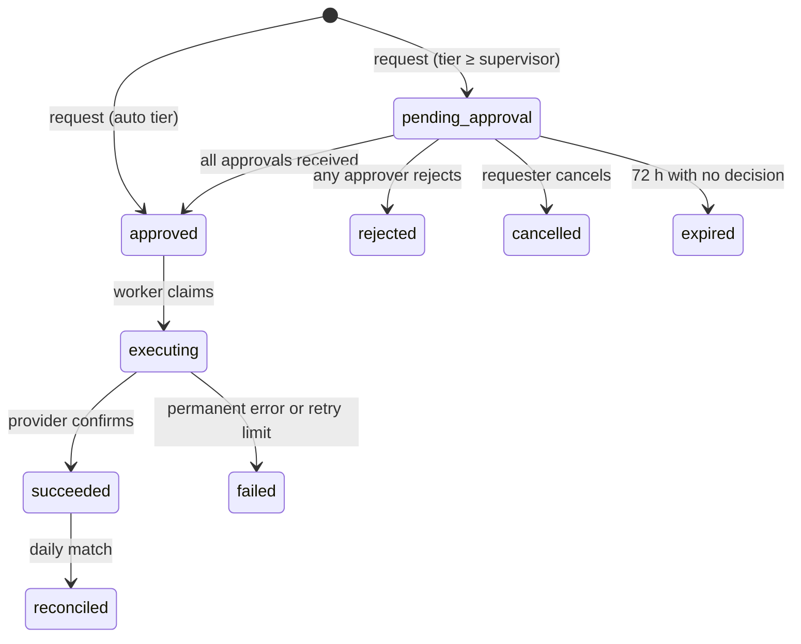

# Internal Tools Foundation and Refunds Console: Product Requirements Document (PRD)

| Field | Value |
|---|---|
| Product | Internal Tools Foundation ("the Foundation"), with two reference tools: Refunds Console and Feature-Flag Panel |
| Version | 1.0 (draft) |
| Date | 4 October 2026 |
| Owner | Engineering (internal tools platform) |
| Status | Draft for review |
| Writing standard | ASD-STE100 Simplified Technical English |
| Related document | `SYSTEM_DESIGN.md` |

---

## 1. Summary

The company uses Microsoft Power Apps for 3 internal tools. It plans 10 or more new tools. Most of these tools will move money or show customer data.

Each new tool needs the same controls: sign-in, permissions, approvals, audit, safe calls to external systems, tests, deployment and monitoring. Power Apps supplies many of these controls as a platform. If the company builds its own tools, it must supply them in a different way.

This product is a shared Foundation that supplies these controls one time, for all tools. Devin builds and maintains the Foundation and the tools. The company hosts and operates them.

Two reference tools prove the Foundation:

1. **Refunds Console** (deep). It is the highest-risk tool of the 3 current tools. It uses every Foundation capability at production quality.
2. **Feature-Flag Panel** (small). A separate Devin session builds it on the Foundation. It proves that a new tool is fast to add and gets all controls with no extra work.

---

## 2. Problem

1. Every internal tool in a fintech needs the same controls. If each team builds them again, the controls are different in each tool. Some tools will have weak controls.
2. Refunds move money. An error causes a direct financial loss. The current app has these risks:
   - Approval rules are in low-code formulas. Engineers cannot easily review or test them.
   - Two clicks or a network retry can send the same refund two times.
   - Nobody can easily prove that the app records agree with the payment provider.
   - Queries on large tables can give incomplete results. Power Apps non-delegable queries process only the first 500 records by default, with a maximum of 2,000.
3. If the company leaves Power Apps, it loses the platform: hosting, identity integration, governance and a single place to see all apps. The build option must replace these.

---

## 3. Capabilities that matter most

This table gives the capabilities in order of importance for a fintech team that builds many internal tools. Each capability is part of the Foundation. Each tool gets it with no extra code.

| Rank | Capability | Why it matters in a fintech | Power Apps equivalent | Foundation implementation |
|---|---|---|---|---|
| 1 | Company sign-in and role mapping | One identity. Leavers lose access at once. | Entra ID, built in | OIDC to Entra ID. IdP groups map to roles. |
| 2 | Server-side permissions | A hidden button is not a control. Auditors test the API. | Dataverse security roles | One policy function. Each API route declares its permission. A test checks every role and action. |
| 3 | Maker-checker approvals | Money and production changes need a second person. | Power Automate approvals | Generic approval engine: tiers, required roles, no self-approval, expiry. |
| 4 | Tamper-evident audit | Regulators and auditors ask "who did what, when". | Dataverse auditing (record changes, not all reads) | Append-only log with a hash chain. Includes reads of personal data and exports. |
| 5 | Safe external side effects | Payment and vendor calls must not run two times or get lost. | Connectors (no idempotency guarantee) | Idempotency keys, transactional outbox, retries, signed webhooks, reconciliation pattern. |
| 6 | Personal data protection | KYC and payment data are high risk. | Column security, DLP | Field masking by role, logged reveal, no PAN storage, synthetic data outside production. |
| 7 | Correct results at scale | A queue that shows the first 2,000 rows can hide a case. | Delegation limits | All filters and sorts in the database. Keyset pages. |
| 8 | Fast new tool ("golden path") | 10 or more tools. The cost of each new tool decides the business case. | Maker studio | Tool template, shared UI kit, a Devin playbook. A plain-English request becomes a reviewed PR. |
| 9 | Tests and CI with security gates | Every change is reviewed and tested before production. | Limited. Test Engine deprecated April 2026. | Unit, integration, browser, permission matrix, SAST, dependency, secret and image scans. |
| 10 | One deployment platform | Each new tool must not need new infrastructure. | Managed hosting | One Terraform stack. A new tool is a new route and a new set of permissions, not a new server. |
| 11 | Observability and runbooks | Somebody must know when a refund is stuck. | Limited app monitoring | Logs, traces and metrics with tool name. Default alerts. Runbook template. |
| 12 | Governance and catalog | Security must see all tools, owners and access. | Admin center, environments, DLP | Tool registry: owner, data class, permissions, approval rules. Quarterly access report. |
| 13 | Maintenance automation | Internal tools rot when nobody owns them. | Microsoft patches the platform | Weekly dependency PRs. Devin Automations on CI failure and alerts. |

Two Power Apps capabilities have no equal in the Foundation:
1. Non-engineers cannot publish a tool alone. An engineer reviews each Devin PR. For money and KYC tools, this is a control, not a defect. For simple forms, it is a cost.
2. Microsoft does not operate the Foundation. The company hosts it and is on call for it.

---

## 4. Goals and non-goals

### 4.1 Goals

| ID | Goal | Measure |
|---|---|---|
| G-1 | Each tool gets all Foundation controls with no extra code | The Feature-Flag Panel contains no auth, audit, approval or logging code of its own |
| G-2 | A new tool is fast to add | A simple tool goes from request to merged PR in 1 day or less (build plus review) |
| G-3 | No duplicate money movement | 0 duplicate provider refunds for each refund record |
| G-4 | No action without the correct approval | 100% of executed actions have the approvals that the policy requires |
| G-5 | Full traceability | 100% of state changes, personal-data reveals and exports have an audit event |
| G-6 | Records agree with external systems | All differences appear as exceptions within 24 hours |
| G-7 | Easy to operate | Each alert has a runbook. On-call can resolve the top 5 incidents without a code change. |

### 4.2 Non-goals

1. The Foundation does not give a drag-and-drop builder to non-engineers.
2. The Foundation is not a general low-code platform. It supports internal web tools with forms, queues, approvals and integrations.
3. Version 1 does not migrate the KYC review queue. The design must support it later (see section 9).
4. The Refunds Console does not replace the payment provider dashboard for disputes or chargebacks.

---

## 5. Users and roles

### 5.1 Users of the Foundation

| User | Need |
|---|---|
| Tool builder (engineer, working with Devin) | Add a new tool fast, with controls already in place |
| Tool owner (operations or finance lead) | Request a tool or a change in plain English. Approve the result. |
| Platform owner (engineering) | Keep the Foundation secure, patched and available |
| Security and compliance | See all tools, their data, their owners and who has access |

### 5.2 Roles in the reference tools

The identity provider (IdP) gives each user a set of groups. The Foundation maps groups to roles. Each tool declares its own roles in the tool registry.

| Role | Tool | Primary tasks |
|---|---|---|
| Support Agent | Refunds | Find a payment. Request a refund. See own requests. |
| Supervisor | Refunds | Approve or reject Supervisor-tier refunds. Request refunds. |
| Finance Approver | Refunds | Approve high-value refunds. Resolve reconciliation exceptions. Export. |
| Flag Editor | Feature flags | Change flags in development and staging. Request production changes. |
| Flag Approver | Feature flags | Approve production flag changes. |
| Auditor | All tools | Read all records and the audit log. Verify the audit chain. Cannot change data. |
| Platform Admin | Foundation | Change policy configuration (with approval). Pause execution. Cannot approve business actions. |
| Service account | Foundation | Execute approved actions. Run reconciliation. No user interface access. |

---

## 6. Scope

### 6.1 In scope (version 1)

**Foundation**
1. Sign-in with the company IdP (OIDC) and group-to-role mapping.
2. Permission policy and route-level enforcement.
3. Approval engine.
4. Audit log with hash chain and verification.
5. Idempotency, transactional outbox, worker and retry policy.
6. Data masking and logged reveal.
7. Shared UI kit: layout, tables with server-side search, forms, approval inbox, audit viewer.
8. Tool registry and tool template.
9. Devin playbook and Knowledge note for "add a tool".
10. CI pipeline with security gates.
11. Observability defaults.
12. Terraform for Azure.

**Refunds Console**
13. Payment search, refund request, policy tiers, approvals, execution, webhooks, reconciliation, export.

**Feature-Flag Panel**
14. Flags for each environment, approval for production changes, audit.

### 6.2 Out of scope (version 1)

1. KYC review queue migration.
2. Refunds to a different payment method, and currency conversion.
3. Mobile application.
4. Customer self-service.
5. A real production deployment. The prototype validates the Terraform but does not apply it.

---

## 7. Part A: Foundation requirements

The priority uses MoSCoW: **M** = must, **S** = should, **C** = could.

### 7.1 Identity and sessions

| ID | Requirement | Priority |
|---|---|---|
| FR-ID-1 | The Foundation must use OIDC authorization code flow with PKCE to sign in users. | M |
| FR-ID-2 | The Foundation must not keep passwords. The IdP does all credential checks, including MFA. | M |
| FR-ID-3 | The Foundation must keep the session in a secure, HTTP-only, SameSite cookie. The browser must not keep access tokens. | M |
| FR-ID-4 | The Foundation must end a session after 30 minutes with no activity and after 8 hours in total. Values are configurable. | M |
| FR-ID-5 | The Foundation must read roles from IdP group claims at each sign-in. It must not keep its own role assignments. | M |
| FR-ID-6 | When the IdP disables a user, the Foundation must refuse that user within 15 minutes. | M |
| FR-ID-7 | The Foundation must record each sign-in, sign-out and failed sign-in as an audit event. | M |

### 7.2 Authorization

| ID | Requirement | Priority |
|---|---|---|
| FR-AZ-1 | Each API route must declare one permission. A route with no permission must fail the build. | M |
| FR-AZ-2 | One policy function must decide each request from: user roles, permission, object attributes and tool rules. | M |
| FR-AZ-3 | The Foundation must refuse by default. | M |
| FR-AZ-4 | Each tool must declare its permission matrix in its registry entry. CI must generate a test for every role and permission. | M |
| FR-AZ-5 | Each permission failure must create an audit event. | M |

### 7.3 Approval engine

| ID | Requirement | Priority |
|---|---|---|
| FR-APR-1 | A tool must be able to mark an action as "approval required" with rules for tiers. Each tier lists the roles that must approve. | M |
| FR-APR-2 | The engine must refuse an approval from the user who requested the action. | M |
| FR-APR-3 | The engine must refuse two approvals from the same user on one request, even if the user has two roles. | M |
| FR-APR-4 | The engine must record the policy version that applied at request time. | M |
| FR-APR-5 | The engine must lock the request content after the first approval. | M |
| FR-APR-6 | The engine must expire requests after a configured time (default 72 hours). | S |
| FR-APR-7 | The engine must give each approver an inbox across all tools. | M |
| FR-APR-8 | The engine must notify approvers through an adapter (email, Slack or Teams). | S |
| FR-APR-9 | A change to an approval policy must itself need approval from a second person. | M |

### 7.4 Audit

| ID | Requirement | Priority |
|---|---|---|
| FR-AUD-1 | The Foundation must write an audit event for each state change, approval, rejection, policy change, export, personal-data reveal, sign-in and permission failure. | M |
| FR-AUD-2 | Each event must include: event ID, time (UTC), tool, actor ID, actor roles, action, object type, object ID, values before and after, request ID, source IP, user agent and result. | M |
| FR-AUD-3 | The Foundation must write the audit event in the same database transaction as the change. | M |
| FR-AUD-4 | The database must refuse UPDATE and DELETE on audit events. | M |
| FR-AUD-5 | Each event must include a hash of the previous event. An Auditor must be able to verify the full chain. | M |
| FR-AUD-6 | The Foundation must send audit events to the company SIEM and to write-once storage. | M (production) |
| FR-AUD-7 | An Auditor must be able to search and export audit events for all tools. | M |

### 7.5 Data protection

| ID | Requirement | Priority |
|---|---|---|
| FR-DP-1 | Each tool must give a data class for each field: public, internal, confidential or restricted. | M |
| FR-DP-2 | The API must mask confidential and restricted fields unless the role has the reveal permission. | M |
| FR-DP-3 | Each reveal must create an audit event. | M |
| FR-DP-4 | The Foundation must not store full card numbers, card security codes or bank account numbers. | M |
| FR-DP-5 | Exports must apply the same masking and must create an audit event with filter and row count. | M |

### 7.6 Safe external side effects

| ID | Requirement | Priority |
|---|---|---|
| FR-SE-1 | Each state-changing API call must accept an idempotency key. The same key and body must return the first result. The same key with a different body must return an error. | M |
| FR-SE-2 | Calls to external systems must go through a transactional outbox. The worker must send them after the database commit. | M |
| FR-SE-3 | The worker must send a stable idempotency key to the external system. A retry must never make a second effect. | M |
| FR-SE-4 | The worker must retry temporary errors with exponential backoff and jitter, up to a configured limit. After the limit, the item must go to a failed state and an alert must start. | M |
| FR-SE-5 | The Foundation must verify webhook signatures and timestamps, store each event before processing, and process each event one time only. | M |
| FR-SE-6 | A late webhook must not move an object back to an earlier state. | M |
| FR-SE-7 | The Foundation must give a reconciliation framework: a job compares internal records with external records and creates exceptions. | M |
| FR-SE-8 | A Platform Admin must be able to pause all execution for one tool (kill switch). | M |

### 7.7 Data access at scale

| ID | Requirement | Priority |
|---|---|---|
| FR-DA-1 | All filters, sorts and counts must run in the database. Results must be correct for the full data set. | M |
| FR-DA-2 | Lists must use keyset pages. | M |
| FR-DA-3 | Search must return the first page in less than 500 ms (p95) for 10 million rows. | S |

### 7.8 Golden path for a new tool

| ID | Requirement | Priority |
|---|---|---|
| FR-GP-1 | The repository must include a tool template. One command must make a new tool with a registry entry, a route, a migration, a page and tests. | M |
| FR-GP-2 | The shared UI kit must supply layout, navigation, server-side tables, forms, approval inbox, audit viewer and masked fields. | M |
| FR-GP-3 | The repository must include a Devin playbook, "Add an internal tool". The playbook must give the steps, the conventions and the definition of done. | M |
| FR-GP-4 | A new tool must not need new infrastructure. It must deploy with the existing application. | M |
| FR-GP-5 | The tool registry must show each tool, its owner, its data class, its roles and its approval rules. | M |

### 7.9 CI, CD and supply chain

| ID | Requirement | Priority |
|---|---|---|
| FR-CI-1 | Each pull request must run: lint, typecheck, unit tests, integration tests against Postgres, browser tests, permission matrix tests. | M |
| FR-CI-2 | Each pull request must run: static analysis (Semgrep), dependency audit, secret scan, container build and image scan. | M |
| FR-CI-3 | CI must produce an SBOM for each image. | S |
| FR-CI-4 | CI must validate the Terraform. | M |
| FR-CI-5 | The main branch must need one human review and green CI before merge. | M |
| FR-CI-6 | A dependency update bot must open PRs each week. | M |
| FR-CI-7 | Database migrations must use the expand-and-contract pattern so that deployment has no downtime. | M |

### 7.10 Observability and operations

| ID | Requirement | Priority |
|---|---|---|
| FR-OB-1 | All logs must be structured JSON with request ID, user ID (not email) and tool name. Logs must not contain secrets or restricted data. | M |
| FR-OB-2 | The Foundation must emit OpenTelemetry traces across API, database, worker and external calls. | M |
| FR-OB-3 | The Foundation must emit default metrics for each tool: request rate, errors, latency, pending approvals, outbox depth, failed executions, open exceptions. | M |
| FR-OB-4 | The Foundation must supply default alerts and a runbook template. Each tool must add a runbook for each alert. | M |
| FR-OB-5 | The Foundation must supply liveness and readiness health checks. | M |
| FR-OB-6 | Devin Automations should open a session on CI failure and on selected alerts. | S |

---

## 8. Part B: Refunds Console requirements

### 8.1 Policy

| Refund amount | Who can request | Approval needed |
|---|---|---|
| Up to 250.00 | Support Agent | None. Executes at once. Counts toward the daily limit. |
| More than 250.00 to 5,000.00 | Support Agent or Supervisor | One Supervisor |
| More than 5,000.00 | Supervisor only | One Supervisor, then one Finance Approver, in this order |
| Always | — | No self-approval. Total refunds must not exceed the charge. Reason code required. Values are configuration. |

### 8.2 Requirements

| ID | Requirement | Priority |
|---|---|---|
| FR-RF-1 | A user with search permission must be able to find charges by charge ID, customer ID, customer email, card last 4 digits, amount and date range. | M |
| FR-RF-2 | The charge page must show the amount, the amount already refunded, the refundable amount and all earlier refunds. | M |
| FR-RF-3 | A Support Agent or Supervisor must be able to request a full or partial refund with an amount, a reason code and a note (10 to 1,000 characters). | M |
| FR-RF-4 | The database must refuse a refund if the amount plus all earlier non-failed refunds is more than the charge amount. | M |
| FR-RF-5 | All amounts must be integers in the minor currency unit with an ISO 4217 currency code. | M |
| FR-RF-6 | Before the user submits, the page must show the policy tier and the approvals that are necessary. | M |
| FR-RF-7 | The system must refuse a request that makes the agent go over the daily limit (default 2,000.00 in auto-tier refunds). | M |
| FR-RF-8 | The requester must be able to cancel a request before the first approval. | S |
| FR-RF-9 | The worker must execute approved refunds through the payment provider adapter with the refund ID as the provider idempotency key. | M |
| FR-RF-10 | Provider webhooks must update the refund state (FR-SE-5, FR-SE-6). | M |
| FR-RF-11 | Daily reconciliation must create exceptions for: refund at the provider but not internal; internal succeeded but not at the provider; amount or currency difference; state difference. | M |
| FR-RF-12 | A Finance Approver must be able to resolve an exception with a resolution code and a note. | M |
| FR-RF-13 | An exception open for more than 48 hours must start an alert. | S |
| FR-RF-14 | The system should flag a request if the same card had refunds in the last 30 days that total more than a configured value. | S |
| FR-RF-15 | A Finance Approver or Auditor must be able to export refunds for a date range as CSV. | M |
| FR-RF-16 | A dashboard should show refunds by state, pending approvals by age, failures and open exceptions. | S |

### 8.3 Refund lifecycle

Rules:
1. Only the transitions in the diagram are permitted. The server refuses all other transitions.
2. `failed`, `rejected`, `cancelled` and `expired` refunds do not count toward the refunded amount.

### 8.4 Permission matrix

| Action | Agent | Supervisor | Finance | Auditor | Platform Admin |
|---|---|---|---|---|---|
| Search charges | Yes | Yes | Yes | Yes | No |
| Reveal customer email | No | Yes | Yes | Yes | No |
| Request refund | Yes | Yes | No | No | No |
| Approve Supervisor step | No | Yes (not own) | No | No | No |
| Approve Finance step | No | No | Yes (not own) | No | No |
| Resolve exception | No | No | Yes | No | No |
| Export | No | No | Yes | Yes | No |
| Read and verify audit | No | No | No | Yes | Yes |
| Pause execution | No | No | No | No | Yes |

The prototype has no in-app policy change. Policy values change through a reviewed pull request (FR-APR-9 is not built).

---

## 9. Part C: Feature-Flag Panel requirements

This tool is small on purpose. It proves G-1 and G-2.

| ID | Requirement | Priority |
|---|---|---|
| FR-FF-1 | A Flag Editor must be able to create a flag and set its value for development, staging and production. | M |
| FR-FF-2 | A change in development or staging must apply at once. | M |
| FR-FF-3 | A change in production must use the approval engine. One Flag Approver must approve. No self-approval. | M |
| FR-FF-4 | Each change must create an audit event with the value before and after. | M |
| FR-FF-5 | Services must read flags through a read-only API with a service token. | S |
| FR-FF-6 | The tool must contain no authentication, authorization, audit, approval or logging code of its own. It must use the Foundation. | M |

**Example of a future tool: KYC review queue.** No KYC tool exists in the prototype. A KYC queue could use the same Foundation: data classes and masking for documents and personal data, the approval engine for escalations, keyset search over the full queue, and the audit log for each document view.

---

## 10. Non-functional requirements

### 10.1 Security

| ID | Requirement |
|---|---|
| NFR-SEC-1 | All traffic must use TLS 1.2 or later. |
| NFR-SEC-2 | All data at rest must be encrypted. Production keys and secrets must be in Azure Key Vault. |
| NFR-SEC-3 | The system must not keep secrets in code, images or logs. |
| NFR-SEC-4 | The system must send security headers: Content-Security-Policy, Strict-Transport-Security, X-Content-Type-Options, frame-ancestors 'none', Referrer-Policy. |
| NFR-SEC-5 | All state-changing requests must have CSRF protection. |
| NFR-SEC-6 | The server must validate all input against a schema. |
| NFR-SEC-7 | The API must limit request rates for each user and each IP address. |
| NFR-SEC-8 | Production must have no public database endpoint. |
| NFR-SEC-9 | Critical vulnerabilities must be fixed within 7 days and high within 30 days. |
| NFR-SEC-10 | The system must have an independent penetration test before production and each year after. |

### 10.2 Availability and recovery

| ID | Requirement |
|---|---|
| NFR-AV-1 | Availability target: 99.9% each month. |
| NFR-AV-2 | Recovery point objective (RPO): 15 minutes or less. |
| NFR-AV-3 | Recovery time objective (RTO): 4 hours or less. |
| NFR-AV-4 | Deployments must have no downtime. |
| NFR-AV-5 | If an external system is not available, users must still be able to request and approve. Execution waits and retries. |

### 10.3 Performance and scale

| ID | Requirement |
|---|---|
| NFR-PERF-1 | API p95 latency less than 300 ms for reads and 500 ms for writes, excluding external calls. |
| NFR-PERF-2 | The design must support 20 tools, 10 million charges, 1 million refunds per year and 500 concurrent users. |
| NFR-PERF-3 | Reconciliation for one day of refunds must complete in less than 15 minutes. |

### 10.4 Data and privacy

| ID | Requirement |
|---|---|
| NFR-DATA-1 | The system must keep financial and audit records for 7 years. (Assumption. Compliance must confirm the period.) |
| NFR-DATA-2 | Each tool must keep only the personal data that its workflow needs. |
| NFR-DATA-3 | For a privacy erasure request, the system must remove or pseudonymize personal data but keep the financial record. Compliance must confirm this rule. |
| NFR-DATA-4 | Non-production environments must use synthetic data only. |

### 10.5 Usability and accessibility

| ID | Requirement |
|---|---|
| NFR-UX-1 | The interface must meet WCAG 2.2 level AA. |
| NFR-UX-2 | The system must support current versions of Edge, Chrome, Firefox and Safari. |
| NFR-UX-3 | Error messages must tell the user what to do next. |

### 10.6 Maintainability

| ID | Requirement |
|---|---|
| NFR-MNT-1 | Line coverage must be 80% or more on Foundation, domain and policy modules. |
| NFR-MNT-2 | The repository must include a Devin Knowledge note with conventions and the definition of done. |
| NFR-MNT-3 | Each tool must have a named owner in the registry. |

---

## 11. Enterprise deployment checklist

Status key:
- **Built**: the prototype implements it.
- **Simulated**: the prototype implements it with a local stand-in.
- **Documented**: the design and the Terraform include it. The prototype does not run it.
- **Client**: the company must supply it. Devin can write the configuration.

Layer key: **F** = Foundation (all tools get it). **T** = tool-specific.

| Area | Item | Layer | Requirement IDs | Status |
|---|---|---|---|---|
| Identity | SSO through OIDC | F | FR-ID-1 | Simulated (Keycloak). Production: Entra ID |
| Identity | MFA and Conditional Access | F | FR-ID-2 | Client (IdP policy) |
| Identity | Deprovisioning through IdP groups | F | FR-ID-5, FR-ID-6 | Built (roles from group claims at sign-in). Not built: IdP re-check during a session (FR-ID-6). Client (SCIM to IdP) |
| Identity | Session timeouts | F | FR-ID-4 | Built |
| Access | Route-level permissions, deny by default | F | FR-AZ-1 to FR-AZ-3 | Built |
| Access | Generated permission matrix tests | F | FR-AZ-4 | Built |
| Access | Separation of duties | F | FR-APR-2, FR-APR-3 | Built |
| Access | Quarterly access review | F | FR-GP-5 | Built (`GET /api/registry` lists tools, owners and roles). Client (process) |
| Access | Break-glass access | F | — | Documented. Client (IdP) |
| Approvals | Tiered maker-checker engine | F | FR-APR-1 to FR-APR-9 | Built, except notifications (FR-APR-8) and in-app policy change approval (FR-APR-9) |
| Money | Integer minor units, currency code | T | FR-RF-5 | Built |
| Money | Over-refund rule in database | T | FR-RF-4 | Built |
| Side effects | Idempotent API | F | FR-SE-1 | Built |
| Side effects | Outbox, worker, retries | F | FR-SE-2 to FR-SE-4 | Built |
| Side effects | Signed, de-duplicated webhooks | F | FR-SE-5, FR-SE-6 | Built (against simulator) |
| Side effects | Reconciliation framework | F | FR-SE-7 | Built (refunds) |
| Side effects | Kill switch | F | FR-SE-8 | Built |
| Audit | Append-only, hash chain, verify | F | FR-AUD-1 to FR-AUD-5 | Built |
| Audit | SIEM and write-once storage | F | FR-AUD-6 | Documented (Terraform). Client (SIEM) |
| Data | Data classes, masking, logged reveal | F | FR-DP-1 to FR-DP-3 | Built |
| Data | No PAN or bank data | F | FR-DP-4 | Built |
| Data | Encryption at rest | F | NFR-SEC-2 | Documented (Terraform) |
| Data | Retention and erasure | F | NFR-DATA-1, NFR-DATA-3 | Documented. Client (policy) |
| Data | Correct results at scale | F | FR-DA-1 to FR-DA-3 | Built |
| App security | CSRF, headers, input schema, rate limits | F | NFR-SEC-4 to NFR-SEC-7 | Built |
| App security | Secrets in Key Vault | F | NFR-SEC-2, NFR-SEC-3 | Simulated (env file). Documented (Key Vault) |
| Supply chain | SAST, dependency, secret and image scans | F | FR-CI-2 | Built |
| Supply chain | SBOM | F | FR-CI-3 | Built |
| Supply chain | Weekly dependency PRs | F | FR-CI-6 | Built (Dependabot config) |
| Supply chain | Branch protection, CODEOWNERS | F | FR-CI-5 | Built (CODEOWNERS file). Client (GitHub settings) |
| Network | Private database, VNet integration, WAF | F | NFR-SEC-8 | Documented (Terraform) |
| Reliability | Health checks, graceful stop | F | FR-OB-5 | Built |
| Reliability | Backups, point-in-time restore, geo-redundant backup | F | NFR-AV-2 | Documented (Terraform) |
| Reliability | Zone-redundant database HA | F | NFR-AV-1 | Documented (Terraform) |
| Reliability | Zero-downtime deploy | F | NFR-AV-4, FR-CI-7 | Documented (slots and expand-and-contract rule). Not tested |
| Reliability | DR test | F | NFR-AV-3 | Client. No disaster recovery test or measurement exists |
| Observability | Logs, traces, metrics | F | FR-OB-1 to FR-OB-3 | Built: JSON logs with request ID, and 4 gauges (`approvals_pending`, `outbox_depth`, `reconciliation_exceptions_open`, `execution_paused`). Not built: OpenTelemetry traces (FR-OB-2), request rate, error and latency metrics |
| Observability | Alerts and runbooks | F, T | FR-OB-4 | Built (runbooks). Documented (alert rules in Terraform `alerts` module, not applied). Client (pager) |
| Operations | On-call rotation | F | — | Client. Devin Automations can triage. |
| Operations | Maintenance automation | F | FR-OB-6, FR-CI-6 | Built (Dependabot). Documented (Devin Automation) |
| Governance | Tool registry and owners | F | FR-GP-5, NFR-MNT-3 | Built |
| Governance | New tool golden path and Devin playbook | F | FR-GP-1 to FR-GP-4 | Built |
| Compliance | Threat model | F | — | Built |
| Compliance | Penetration test | F | NFR-SEC-10 | Client |
| Compliance | SOC 2 control mapping | F | — | Documented. Client (auditor) |
| Compliance | PCI DSS scope confirmation | F | FR-DP-4 | Client (QSA) |
| Quality | Unit, integration, browser tests | F, T | FR-CI-1 | Built |
| Quality | Accessibility check | F | NFR-UX-1 | Built (automated axe). Client (manual audit) |
| Environments | Dev, staging, production with separate data and secrets | F | NFR-DATA-4 | Documented (Terraform) |

---

## 12. Acceptance criteria

1. **Self-approval is blocked.** Given Agent A requested refund R for 3,200.00. When Agent A, who also has the Supervisor role, tries to approve R. Then the server returns 403, R stays `pending_approval`, and an audit event records the denied attempt.
2. **Two-approver tier.** Given refund R for 7,500.00. When a Supervisor approves R, then R stays `pending_approval` and appears in the Finance inbox. When a different Finance Approver approves R, then R goes to `approved` and the worker executes it.
3. **Double click.** Given an agent submits the same request two times with the same idempotency key. Then the system creates one refund and returns the same response two times.
4. **Concurrent over-refund.** Given a charge of 100.00 with no refunds. When two agents request 80.00 at the same time. Then one request succeeds and the other fails with "amount exceeds refundable balance".
5. **Provider timeout.** Given the provider times out on the first call and succeeds on the retry. Then the provider has exactly one refund and R is `succeeded`.
6. **Webhook out of order.** Given `refund.succeeded` arrives before `refund.pending`. Then R stays `succeeded`.
7. **Reconciliation exception.** Given the provider has a refund that the system does not have. When reconciliation runs, then an exception of type `missing_internal` appears in the Finance queue.
8. **Tamper evidence.** Given a database administrator changes an audit row directly, with triggers disabled. When an Auditor runs verify, then verify reports the first broken event ID.
9. **Kill switch.** Given a Platform Admin pauses refunds execution. Then approved refunds stay `approved` until resume. A banner and the metric `execution_paused` show the pause.
10. **Route without permission.** Given a developer adds a route with no permission. Then the API does not start and the tests fail.
11. **New tool inherits controls.** Given a separate Devin session builds the Feature-Flag Panel from the playbook. Then the PR adds only tool files (registry entry, routes, migration, pages, tests). The production flag change needs approval, writes audit events, with no new auth, audit, approval or logging code.

---

## 13. Success metrics (after launch)

| Metric | Target |
|---|---|
| Time from tool request to merged PR (simple tool) | 1 day or less |
| Duplicate external effects | 0 |
| Actions executed without the necessary approvals | 0 |
| Open reconciliation exceptions older than 48 hours | 0 |
| Lead time for a policy change | 1 day or less |
| Change failure rate | Less than 15% |
| Critical vulnerabilities older than 7 days | 0 |
| Tools with no named owner | 0 |

---

## 14. Delivery plan

### 14.1 Prototype

The prototype contains the Foundation, the Refunds Console and the Feature-Flag Panel. The README status table lists what is built, simulated, documented and client-owned.

Known limits of the prototype:

- The audit hash chain is not keyed. Production needs an external head anchor.
- Exactly-once applies to one refund ID, not to one customer intent.
- There is no live Azure deployment. The Terraform is validated only.
- The payment provider is simulated. No KYC vendor integration exists.
- There is no measured cost and no tested disaster recovery.

### 14.2 Path to production

1. Connect Entra ID. Map groups to roles.
2. Replace the payment simulator with the provider adapter in test mode. Run the contract tests.
3. Apply the Terraform to a staging subscription.
4. Run a penetration test. Fix the findings.
5. Run the Refunds Console in parallel with the Power Apps app for 2 weeks. Reconcile both against the provider.
6. Move users. Remove the Power Apps app.
7. Build the next tools on the Foundation, in order of risk.

---

## 15. Risks

| Risk | Effect | Mitigation |
|---|---|---|
| Nobody owns the Foundation after launch | Slow fixes, security debt in every tool | Name a platform owner. Use Devin Automations for CI failures and dependency PRs. |
| The Foundation becomes a bottleneck | Tool teams wait for platform changes | Tools extend the Foundation through defined interfaces. Platform changes follow the same PR process. |
| The provider API behaves differently from the simulator | Execution errors in production | Contract tests against provider test mode before go-live |
| Policy thresholds are wrong | Too many or too few approvals | Thresholds are configuration. Finance approves the first values. |
| Non-engineers cannot change tools alone | Slower small changes than Power Apps | Requests go to Devin through Slack or Linear. Simple forms can stay in Power Apps. |
| Compliance requires controls that this PRD does not include | Launch delay | Compliance review of this PRD before build |

---

## 16. Assumptions and open questions

### 16.1 Assumptions

1. The company uses Microsoft Entra ID. Power Apps use implies this.
2. The company uses Azure or can use Azure.
3. The payment provider supports refund idempotency keys and signed webhooks. Stripe supports both.
4. The company has a SIEM.

### 16.2 Open questions

1. What are the correct approval thresholds and daily limits?
2. What is the legal retention period for refund records?
3. Which payment provider or providers does the company use?
4. Which channel must approver notifications use: email, Slack or Teams?
5. Who owns the Foundation after launch?
6. Which of the 10 planned tools are low-risk forms that can stay in Power Apps?
