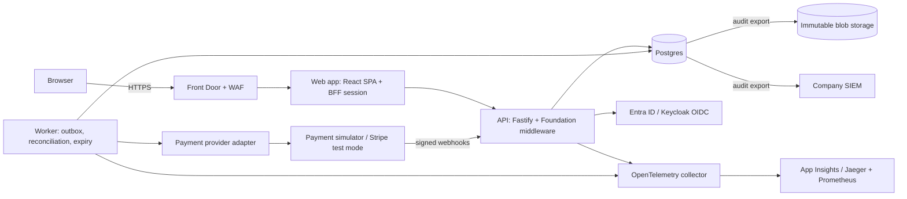
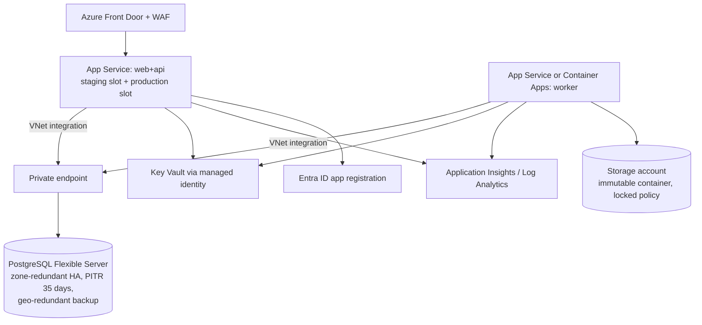

# Internal Tools Foundation and Refunds Console: System Design

| Field | Value |
|---|---|
| Version | 1.0 (draft) |
| Date | 4 October 2026 |
| Writing standard | ASD-STE100 Simplified Technical English |
| Related document | `PRD.md` (requirement IDs in this document refer to the PRD) |

---

## 1. Context

The company builds many internal tools. Each tool needs the same controls. This design puts those controls in one Foundation. Each tool is a module on the Foundation. The Refunds Console is the first and most complex tool. The Feature-Flag Panel is the second tool and proves reuse.

### 1.1 Design principles

1. **Controls in one place.** A tool cannot skip a control, because the Foundation applies it before the tool code runs.
2. **The server decides.** The user interface only shows what the server permits.
3. **The database is the last line of defence.** Money rules, audit immutability and state rules are also database constraints.
4. **One deployable unit.** A new tool adds code, not infrastructure.
5. **Boring technology.** Postgres, TypeScript, OIDC, Terraform. Devin and the company engineers know these well.
6. **Same shape locally and in production.** Docker Compose locally. The same images on Azure.

### 1.2 Constraints

1. Devin Enterprise does not host applications. The company hosts on its own cloud. (Source: Devin deployment docs.)
2. The company uses Microsoft Entra ID (assumption).
3. The prototype must run with one command and no secrets.

---

## 2. Architecture overview



### 2.1 Components

| Component | Responsibility | Technology |
|---|---|---|
| Web | Single-page app. Shared UI kit. One route group for each tool. | React, Vite, TypeScript, TanStack Query |
| API | HTTP API and backend-for-frontend (BFF) session. Applies all Foundation middleware. Hosts tool routes. | Node.js, Fastify, TypeScript, Zod |
| Worker | Sends outbox items, runs reconciliation, expires approvals, exports audit. Separate process, same code base. | Node.js, Postgres `SKIP LOCKED` queue |
| Database | System of record for all tools. One schema for the Foundation, one schema for each tool. | PostgreSQL 16, `pg` and versioned SQL migrations |
| Identity provider | Sign-in and groups. | Keycloak locally; Entra ID in production |
| Payment simulator | Local stand-in for the provider: refunds API with idempotency keys, delays, failures, signed webhooks, list API for reconciliation. | Small Fastify service |
| Observability | Traces, metrics, logs. | OpenTelemetry SDK; Jaeger and Prometheus locally; Azure Monitor in production |

### 2.2 Why one deployable unit

The API and the web app deploy as one service. The worker deploys as a second service from the same image. A new tool is a module in the same code base. This keeps operations cost flat as the number of tools increases. If one tool needs isolation later (for example, the KYC queue), the module boundary permits a split.

---

## 3. Repository layout

```
/
├── apps/
│   ├── api/                 # Fastify server, mounts Foundation + tools
│   ├── web/                 # React SPA, mounts tool route groups
│   └── worker/              # outbox, reconciliation, expiry, audit export
├── packages/
│   ├── foundation/          # identity, policy, approvals, audit, idempotency,
│   │                        # outbox, masking, registry, telemetry
│   ├── ui-kit/              # layout, DataTable, Form, ApprovalInbox, AuditViewer, MaskedField
│   └── testing/             # fixtures, role helpers, permission-matrix generator
├── tools/
│   ├── refunds/             # registry.ts, routes, domain, migrations, pages, tests, runbook
│   └── feature-flags/       # same shape
├── services/
│   └── payment-simulator/
├── infra/
│   ├── terraform/           # Azure modules and environments
│   ├── keycloak/            # realm export with seeded users and groups
│   └── otel/
├── scripts/new-tool.ts      # tool template generator
├── docs/                    # PRD, design, threat model, runbooks, ADRs
├── .devin/                  # playbook "Add an internal tool", Knowledge note
├── .github/workflows/       # CI
└── docker-compose.yml
```

---

## 4. Tool model

Each tool exports one registry entry. The Foundation reads it at start time.

```ts
export const refundsTool = defineTool({
  id: "refunds",
  name: "Refunds Console",
  owner: "payments-ops@company.example",
  dataClass: "restricted",
  roles: {
    agent:      { idpGroup: "tool-refunds-agent" },
    supervisor: { idpGroup: "tool-refunds-supervisor" },
    finance:    { idpGroup: "tool-refunds-finance" },
  },
  permissions: {
    "charge.search":     ["agent", "supervisor", "finance", "auditor"],
    "customer.reveal":   ["supervisor", "finance", "auditor"],
    "refund.request":    ["agent", "supervisor"],
    "refund.approve":    ["supervisor", "finance"],
    "exception.resolve": ["finance"],
    "refund.export":     ["finance", "auditor"],
  },
  approvals: {
    "refund.execute": refundPolicy,          // tiers, see section 7
  },
  fields: {
    "customer.email": "confidential",
    "card.last4":     "internal",
  },
  routes, pages, migrations, reconcilers: [refundReconciler],
});
```

Rules:
1. `auditor` and `platform_admin` are global roles. The Foundation adds them to each tool.
2. CI generates one test for each (role, permission) pair from this entry (FR-AZ-4).
3. The registry page lists each tool, its owner, data class, roles and approval rules (FR-GP-5).

---

## 5. Request pipeline

Each API request passes these steps in this order. Tool code runs only at step 9.

| Step | Middleware | Result on failure |
|---|---|---|
| 1 | Request ID and trace context | — |
| 2 | Security headers, CORS (same origin only) | — |
| 3 | Rate limit (user and IP, token bucket in Postgres or memory) | 429 |
| 4 | Session: read cookie, load session, check idle and absolute timeout | 401 |
| 5 | User status: re-check with IdP every 15 minutes (refresh token) | 401 and session end |
| 6 | CSRF check for non-GET (double-submit token) | 403 |
| 7 | Input validation (Zod schema on the route) | 400 |
| 8 | Authorization: `authorize(user, permission, resource?)` | 403 and audit event |
| 9 | Idempotency (state-changing routes): look up key | Stored response or 409/422 |
| 10 | Tool handler in one database transaction, with audit writer | — |
| 11 | Response masking by data class and role | — |
| 12 | Structured access log | — |

A route definition must include `permission`. The server refuses to start, and CI fails, if a route has no permission (FR-AZ-1).

```ts
route.post("/refunds", {
  permission: "refund.request",
  body: CreateRefundSchema,
  idempotent: true,
  handler: createRefund,
});
```

---

## 6. Identity and sessions

1. **Flow.** OIDC authorization code with PKCE. The API is a confidential client (BFF). The browser never receives tokens (FR-ID-3).
2. **Session.** Server-side row in `foundation.sessions`: user ID, groups, roles, created time, last activity, encrypted refresh token. Cookie: `__Host-sid`, `Secure`, `HttpOnly`, `SameSite=Lax`.
3. **Roles.** Computed at sign-in from the `groups` claim through the registry mapping. Not stored elsewhere (FR-ID-5).
4. **Deprovisioning.** Every 15 minutes the API uses the refresh token. If the IdP refuses it, the session ends (FR-ID-6). Entra ID SCIM and Conditional Access stay in the IdP.
5. **Local.** Keycloak realm with seeded users for each role, including one user with both Agent and Supervisor roles to test separation of duties.
6. **Production.** Entra ID app registration. Group claims or app roles. MFA and Conditional Access through Entra policy.

---

## 7. Approval engine

### 7.1 Policy definition

```ts
export const refundPolicy = definePolicy({
  version: 3,
  tiers: [
    { name: "auto",       when: (r) => r.amountMinor <= 25_000,  steps: [] },
    { name: "supervisor", when: (r) => r.amountMinor <= 500_000, steps: [["supervisor"]] },
    { name: "dual",       when: () => true,                      steps: [["supervisor"], ["finance"]] },
  ],
  expiresAfterHours: 72,
});
```

1. Each step needs one approval from a user with one of the listed roles.
2. Steps in a tier can complete in any order.
3. Policy values (thresholds, limits) are in `foundation.policy_versions`. A change creates a new version in state `proposed`. It becomes `active` only after a second person approves it (FR-APR-9).

### 7.2 Rules that the engine enforces

| Rule | Where enforced |
|---|---|
| Approver is not the requester | Engine check and DB constraint `CHECK (approver_id <> requester_id)` through a denormalized requester column |
| One approval for each user on each request | Unique index `(approval_request_id, approver_id)` |
| One approval for each step | Unique index `(approval_request_id, step_index)` |
| Content locked after first approval | Request content hash stored at creation. Tool tables refuse updates while an approval request is open (trigger). |
| Concurrent approvals | `SELECT ... FOR UPDATE` on the approval request row |
| Policy version recorded | `policy_version` column, not null |

### 7.3 Approval data

```
foundation.approval_requests
  id uuid pk, tool_id text, action text, object_type text, object_id uuid,
  requester_id text, tier text, policy_version int, content_hash bytea,
  status text check (status in ('pending','approved','rejected','cancelled','expired')),
  created_at timestamptz, expires_at timestamptz, decided_at timestamptz

foundation.approvals
  id uuid pk, approval_request_id uuid fk, step_index int, approver_id text,
  approver_role text, decision text check (decision in ('approve','reject')),
  reason text, created_at timestamptz,
  unique (approval_request_id, approver_id),
  unique (approval_request_id, step_index)
```

When the last step is approved, the engine calls the tool `onApproved` hook in the same transaction. For refunds, the hook moves the refund to `approved` and writes an outbox item.

---

## 8. Audit log

### 8.1 Table

```
foundation.audit_events
  seq bigint generated always as identity primary key,
  id uuid, occurred_at timestamptz, tool_id text,
  actor_id text, actor_roles text[], action text,
  object_type text, object_id text,
  before jsonb, after jsonb, result text,
  request_id text, source_ip inet, user_agent text,
  prev_hash bytea, hash bytea
```

### 8.2 Hash chain

```
hash(n) = SHA-256( hash(n-1) || canonical_json(event n without hash fields) )
hash(0) = SHA-256("genesis")
```

1. The audit writer takes a transaction-level advisory lock, reads the last hash, computes the new hash and inserts. This serializes audit writes. Expected write volume (less than 50 for each second) permits this.
2. A trigger refuses `UPDATE` and `DELETE`. The application database role has `INSERT` and `SELECT` only on this table. A separate owner role owns the table.
3. `GET /audit/verify` recomputes the chain and returns the first broken `seq`, if any.
4. **Production anchor.** The worker exports each hour the new events and the last hash to Azure Blob Storage with a locked time-based retention policy (WORM). A database administrator who rewrites the full chain cannot change the exported anchors. Microsoft states that locked WORM policies meet SEC 17a-4(f) storage requirements (Cohasset assessment).
5. **SIEM.** The same export goes to the company SIEM through Azure Monitor diagnostic settings or a log forwarder.

### 8.3 What creates an audit event

All items in FR-AUD-1. The writer is part of the transaction (FR-AUD-3). If the audit insert fails, the business change rolls back.

---

## 9. Idempotency and side effects

### 9.1 API idempotency

```
foundation.idempotency_keys
  key text, actor_id text, route text,
  request_hash bytea, status text, response_code int, response_body jsonb,
  created_at timestamptz,
  primary key (actor_id, route, key)
```

1. The client sends `Idempotency-Key` (UUID). The UI makes one key for each form open.
2. Insert with `ON CONFLICT DO NOTHING`. If the row exists with the same `request_hash`, return the stored response. If the hash is different, return 422. If the first request is still in progress, return 409.
3. Keys expire after 24 hours. (Stripe uses a similar rule: keys can be removed after they are at least 24 hours old.)

### 9.2 Transactional outbox

```
foundation.outbox
  id uuid pk, tool_id text, kind text, payload jsonb, idempotency_key text unique,
  status text check (status in ('pending','in_flight','done','failed')),
  attempts int, next_attempt_at timestamptz, last_error text, created_at timestamptz
```

1. The tool handler inserts the outbox row in the same transaction as the business change (FR-SE-2).
2. The worker claims rows with `SELECT ... FOR UPDATE SKIP LOCKED WHERE status='pending' AND next_attempt_at <= now()`.
3. The worker calls the tool handler for `kind`. For refunds, it calls the provider with `Idempotency-Key = refund.id` (FR-SE-3).
4. Retry: delay = min(2^attempts × 5 s, 15 min) plus random jitter, up to 8 attempts. Then status `failed`, tool object `failed`, alert (FR-SE-4).
5. A row stuck in `in_flight` for more than 5 minutes returns to `pending`. This is safe because the provider call is idempotent.
6. **Kill switch.** `foundation.tool_settings.execution_paused`. The worker skips paused tools and emits a metric (FR-SE-8).

### 9.3 Webhooks

```
foundation.inbound_events
  provider text, event_id text, type text, payload jsonb,
  received_at timestamptz, processed_at timestamptz, error text,
  primary key (provider, event_id)
```

1. Verify the signature on the raw body with the endpoint secret. Refuse if the timestamp is older than 5 minutes (FR-SE-5).
2. Insert the event. On conflict, return 200 and do nothing (duplicate).
3. Return 200 quickly. The worker processes the event.
4. **Out of order.** Each refund state has a rank. An event can move a refund only to a higher rank: `executing (2) < succeeded (3) = failed (3) < reconciled (4)` (FR-SE-6).

### 9.4 Reconciliation framework

```ts
interface Reconciler<I, E> {
  id: string;
  listInternal(window: TimeWindow): AsyncIterable<I>;
  listExternal(window: TimeWindow): AsyncIterable<E>;
  key(i: I | E): string;            // e.g. provider refund ID
  compare(i?: I, e?: E): ExceptionType | null;
}
```

1. The worker runs each reconciler each day at 02:00 UTC for the previous 3 days (overlap catches late events), and on demand.
2. Exception types: `missing_internal`, `missing_external`, `amount_mismatch`, `currency_mismatch`, `state_mismatch`.
3. Exceptions are unique by `(reconciler, key, type)`. A new run does not duplicate an open exception.
4. A match moves the refund from `succeeded` to `reconciled`.

---

## 10. Refunds Console design

### 10.1 Data

```
refunds.charges
  id text pk, customer_id text, customer_email text, card_brand text, card_last4 char(4),
  amount_minor bigint check (amount_minor > 0), currency char(3),
  refunded_minor bigint not null default 0 check (refunded_minor >= 0),
  created_at timestamptz,
  check (refunded_minor <= amount_minor)

refunds.refunds
  id uuid pk, charge_id text fk, amount_minor bigint check (amount_minor > 0), currency char(3),
  reason_code text, note text, requester_id text, status text, tier text,
  policy_version int, approval_request_id uuid, provider_refund_id text unique,
  failure_code text, created_at timestamptz, updated_at timestamptz

refunds.agent_daily_totals
  agent_id text, day date, auto_minor bigint, primary key (agent_id, day)
```

Indexes: `charges(customer_id)`, `charges(card_last4, created_at)`, `charges(created_at, id)` for keyset pages, trigram index on `customer_email`, `refunds(status, created_at)`, `refunds(charge_id)`.

### 10.2 Create refund (the money rule)

```sql
BEGIN;
SELECT amount_minor, refunded_minor, currency FROM refunds.charges WHERE id = $1 FOR UPDATE;
-- app: check amount <= amount_minor - refunded_minor, currency match, daily limit
UPDATE refunds.charges SET refunded_minor = refunded_minor + $amount WHERE id = $1;
INSERT INTO refunds.refunds (...);
-- approval request or outbox row, audit event, idempotency row
COMMIT;
```

1. `refunded_minor` reserves the amount at request time. A rejected, cancelled, expired or failed refund releases the amount in the same transaction as its state change.
2. The row lock serializes concurrent requests on one charge. The `CHECK (refunded_minor <= amount_minor)` refuses an over-refund even if application code has a defect (FR-RF-4).
3. The daily limit uses an `INSERT ... ON CONFLICT DO UPDATE ... WHERE auto_minor + $amount <= $limit` on `agent_daily_totals`. Zero rows updated means the limit is exceeded (FR-RF-7).

### 10.3 State transitions

A single function `transition(refund, to, cause)` checks the allowed-transition table from PRD section 8.3, updates the row, adjusts `refunded_minor` if needed and writes the audit event. A database trigger checks the same table as a second control.

### 10.4 Payment provider adapter

```ts
interface PaymentProvider {
  createRefund(input: { chargeId: string; amountMinor: bigint; currency: string;
                        idempotencyKey: string; metadata: Record<string,string> })
    : Promise<{ providerRefundId: string; status: "pending" | "succeeded" | "failed" }>;
  listRefunds(window: TimeWindow): AsyncIterable<ProviderRefund>;
  verifyWebhook(rawBody: Buffer, headers: Headers): ProviderEvent;  // throws on bad signature
}
```

Implementations: `SimulatorProvider` (default), `StripeProvider` (test mode, enabled when `STRIPE_SECRET_KEY` is present). The simulator supports fault injection through headers or config: timeout, 500 error, duplicate webhook, out-of-order webhook, and a "ghost refund" that exists only at the provider. The tests use these faults for acceptance criteria 5 to 7.

---

## 11. Feature-Flag Panel design

1. Tables: `feature_flags.flags (key, description, owner)`, `feature_flags.values (flag_key, environment, value jsonb, version)`.
2. Development and staging changes write directly, with audit.
3. Production changes create an approval request with one step `["flag_approver"]`. `onApproved` writes the new value.
4. Read API `GET /flags/:env` uses a service token with permission `flags.read`.
5. The tool uses only Foundation APIs: `defineTool`, `route`, `definePolicy`, `audit`, `DataTable`, `ApprovalInbox`. A CI rule (dependency-cruiser) refuses imports from tool code into Foundation internals.

---

## 12. Web application

1. One shell: top bar with user, roles and environment badge; left navigation from the registry (only tools that the user can open).
2. Shared components: `DataTable` (server-side filters, keyset pages), `Form` (Zod schema shared with API), `ApprovalInbox` (all tools), `AuditViewer`, `MaskedField` (reveal button calls the API and creates an audit event), `ConfirmDialog` with idempotency key.
3. Refunds pages: search, charge detail, request form with live tier preview, inbox, refund detail with timeline, exceptions queue, dashboard.
4. Accessibility: semantic HTML, keyboard navigation, axe checks in Playwright.

---

## 13. Security design

### 13.1 Controls

| Threat area | Control |
|---|---|
| Authentication | OIDC with PKCE, BFF, no tokens in browser, `__Host-` cookie |
| Session theft | Short idle timeout, rotation at sign-in, IdP re-check |
| CSRF | SameSite cookie plus double-submit token |
| XSS | React escaping, strict CSP (`default-src 'self'`, no inline script), no `dangerouslySetInnerHTML` (lint rule) |
| Injection | Parameterized queries only (`pg`), Zod validation |
| Broken access control | Deny by default, route permission required, generated matrix tests |
| Insider fraud | Separation of duties, approvals, daily limits, audit with anchors |
| Duplicate money movement | Idempotency at API and provider, outbox, DB check constraint |
| Webhook forgery | Signature and timestamp check, de-duplication |
| Data exposure | Data classes, masking, logged reveal, no PAN, synthetic non-prod data |
| Secrets | Key Vault references in App Service settings, managed identity, no secrets in repo (gitleaks) |
| Supply chain | Lockfile, Dependabot, npm audit, Semgrep, Trivy image scan, SBOM, pinned base images |
| Denial of service | WAF, rate limits, request size limits, statement timeout in Postgres |

### 13.2 Threat model summary (STRIDE)

| STRIDE | Example | Mitigation |
|---|---|---|
| Spoofing | Forged webhook claims a refund succeeded | Signature, timestamp, reconciliation |
| Tampering | Admin edits an audit row | Trigger, role separation, hash chain, WORM anchor |
| Repudiation | Approver denies an approval | Audit with actor, IP, request ID, IdP sign-in logs |
| Information disclosure | Agent exports customer emails | Export permission, masking, export audit |
| Denial of service | Approval flood | Rate limits, WAF |
| Elevation of privilege | Agent with two roles approves own refund | Engine check and DB constraint |

The full threat model is in `docs/threat-model.md`.

---

## 14. Observability

| Signal | Content |
|---|---|
| Logs | JSON (pino). Fields: time, level, request_id, trace_id, tool, user_id, route, status, duration_ms. Redaction list for secrets and restricted fields. |
| Traces | OpenTelemetry auto-instrumentation for HTTP, Postgres and outbound calls. Span attributes: tool, action, object ID. |
| Metrics | `http_requests_total`, `http_request_duration_seconds`, `approvals_pending{tool,tier}`, `approval_age_seconds`, `outbox_depth{tool}`, `outbox_failed_total`, `reconciliation_exceptions_open{type}`, `execution_paused{tool}`, `audit_verify_ok`. |
| Alerts | Outbox failed > 0; outbox depth > 100 for 10 min; exception open > 48 h; audit verify fails; execution paused > 1 h; error rate > 2% for 5 min; p95 latency > 1 s for 10 min. |
| SLOs | Availability 99.9% monthly; approval-to-execution under 5 min for 99% of refunds. |
| Runbooks | `docs/runbooks/`: refund stuck in executing; outbox failures; reconciliation exception; audit verify failed; provider outage; how to pause and resume execution. |

Locally, the compose stack runs Jaeger and Prometheus. In production, the OpenTelemetry exporter sends to Azure Monitor Application Insights.

---

## 15. Deployment on Azure

### 15.1 Topology



### 15.2 Terraform

```
infra/terraform/
  modules/ network, postgres, app_service, worker, key_vault, monitoring, storage_worm, front_door
  envs/ dev, staging, prod   (separate state, separate subscription or resource group)
```

1. CI runs `terraform fmt -check`, `terraform validate` and `tflint` on each PR (FR-CI-4).
2. The prototype does not run `terraform apply`. Production apply needs a separate pipeline with manual approval.
3. Postgres: geo-redundant backup can be set only at server creation, so the module sets it at creation. Default backup retention is 7 days; the module sets 35 days, the maximum. Microsoft states a typical RPO of up to 5 minutes for point-in-time restore, which meets NFR-AV-2.

### 15.3 Release process

1. PR → CI green → one review → merge to `main`.
2. Pipeline builds one image, tags it with the commit SHA, scans it and pushes it.
3. Deploy to staging. Run migrations (expand step only). Run smoke tests.
4. Deploy to the production staging slot. Warm up. Swap. App Service warms all instances of the slot before the swap, so no requests are dropped. A swap back is the rollback.
5. Contract migrations run in a later release, after no code uses the old shape.

### 15.4 Environments

| Environment | Data | Identity | Payments |
|---|---|---|---|
| Local | Synthetic seed (100,000 charges) | Keycloak | Simulator |
| Dev / staging | Synthetic | Entra ID (test groups) | Provider test mode |
| Production | Real | Entra ID | Provider live |

---

## 16. Reliability and failure modes

| Failure | Effect | Behaviour |
|---|---|---|
| Provider down | No execution | Outbox retries with backoff. Users can still request and approve. Alert after first failure batch. |
| Provider timeout after it made the refund | Unknown result | Retry with same idempotency key returns the original refund. Reconciliation confirms. |
| Worker stops during a call | Row stuck `in_flight` | Lease timeout returns it to `pending`. Idempotent retry. |
| Duplicate webhook | — | Primary key on event ID. |
| Database failover | Short write outage | Zone-redundant HA fails over automatically. Clients reconnect. Idempotency makes client retries safe. |
| Region loss | Outage | Restore from geo-redundant backup in the paired region (RTO 4 h target). |
| Audit write fails | Business change fails | Same transaction. The user sees an error and retries. |
| Bad deploy | Errors | Slot swap back. Migrations are backward compatible. |

---

## 17. Performance and scale

1. Search uses indexes and keyset pages. No `OFFSET` on large tables.
2. Counts on large result sets use estimates above 10,000 rows, with "10,000+" in the UI.
3. Postgres statement timeout: 5 seconds for user requests, 10 minutes for reconciliation.
4. The seed has 100,000 charges locally. A test checks that search p95 is less than 500 ms on the seed. The production target (10 million) needs a load test in staging.

---

## 18. Testing strategy

| Level | Scope | Tool |
|---|---|---|
| Unit | Policy tiers, state transitions, hash chain, masking, retry schedule | Vitest |
| Integration | API with real Postgres: idempotency, concurrency (parallel requests on one charge), constraints, audit triggers, outbox, webhooks | Vitest + Testcontainers or CI Postgres service |
| Permission matrix | Every (role, permission) pair for each tool, generated from the registry | Vitest |
| Contract | Provider adapter against simulator; against Stripe test mode when a key exists | Vitest |
| End to end | Acceptance criteria 1, 2, 7, 9, 11 through the browser with Keycloak sign-in | Playwright |
| Accessibility | Main pages | axe-core in Playwright |
| Security | SAST, dependencies, secrets, image, IaC | Semgrep, npm audit, gitleaks, Trivy, tflint |
| Architecture | Tools import only the public Foundation API | dependency-cruiser |

---

## 19. Devin in the lifecycle

| Activity | How Devin does it | Human role |
|---|---|---|
| Build a new tool | Playbook "Add an internal tool" in `.devin/`. A request from Slack or Linear starts a session. Devin runs `scripts/new-tool.ts`, writes the domain code and tests, and opens a PR. | Tool owner writes the request. An engineer reviews and merges. |
| Change a policy | Devin changes configuration and tests, and opens a PR. Policy activation still needs a second approver in the app. | Finance approves. Engineer reviews. |
| CI failure | A Devin Automation on CI failure opens a session that diagnoses and pushes a fix PR. | Engineer reviews. |
| Dependency and security updates | Dependabot opens PRs. Devin fixes breaking changes. | Engineer reviews. |
| Incident triage | A Devin Automation on an alert reads logs and traces and proposes a fix or a runbook action. | On-call engineer decides. |

Devin does not host, operate or carry the pager. The company does.

---

## 20. Key decisions

| Decision | Choice | Alternatives considered | Reason |
|---|---|---|---|
| Scope | Foundation plus one deep tool plus one small tool | Many shallow tools; one tool only | Proves both depth (money controls) and reuse (cost of tool N) |
| Deep tool | Refunds | KYC queue | Most controls: money, approvals, idempotency, reconciliation |
| Stack | TypeScript, Fastify, React, Postgres | Retool or another low-code; Python | One language front to back; strong types for money and policy; widely known |
| Deployment | One app service plus one worker | One service for each tool | Operations cost stays flat as tools increase |
| Approval logic | Generic engine in Foundation | Per-tool code | One place to audit separation of duties |
| Audit integrity | Hash chain plus WORM anchor | Plain table; external ledger database | Strong evidence with no new database product |
| Side effects | Outbox plus idempotency keys | Direct calls in the request | No lost or duplicate effects when processes stop |
| Identity locally | Keycloak (real OIDC) | Mock role switcher | Same protocol as Entra ID; tests the real session code |
| Payments locally | Simulator with fault injection | Stripe test mode only | No secrets needed; can force rare failures in tests |
| Cloud | Azure | AWS, GCP | The company already uses Microsoft identity; Microsoft-hosted with no per-user license |
| IaC | Terraform, validated not applied | Bicep; no IaC | Common skill; the prototype must not create cloud cost |

---

## 21. Prototype versus production

| Item | Prototype | Production |
|---|---|---|
| Identity | Keycloak with seeded users | Entra ID, MFA, Conditional Access |
| Payments | Simulator (Stripe test mode optional) | Provider live account |
| Hosting | Docker Compose | Azure App Service, Postgres Flexible Server |
| Secrets | `.env.example` with local values | Key Vault with managed identity |
| Audit anchor | Local file export | Immutable blob storage, SIEM |
| Observability | Jaeger, Prometheus | Application Insights, pager integration |
| Terraform | Validated in CI | Applied through approved pipeline |
| Compliance | Threat model, control list | Pen test, SOC 2 scope, PCI scope confirmation |

---

## 22. Sources

- Devin deployment capabilities (Enterprise orgs deploy to own infrastructure): https://docs.devin.ai/product-guides/deployment-capabilities
- Devin Automations: https://docs.devin.ai/product-guides/automations
- Power Apps delegation limits: https://learn.microsoft.com/en-us/power-apps/maker/canvas-apps/delegation-overview
- Power Apps Test Engine deprecation: https://learn.microsoft.com/en-us/power-platform/test-engine/overview
- Azure App Service authentication: https://learn.microsoft.com/en-us/azure/app-service/overview-authentication-authorization
- Azure App Service deployment slots (warm-up, no dropped requests): https://learn.microsoft.com/en-us/azure/app-service/deploy-staging-slots
- Azure Database for PostgreSQL backup (7 to 35 days, RPO up to 5 minutes, geo-redundant at creation only): https://learn.microsoft.com/en-us/azure/postgresql/flexible-server/concepts-backup-restore
- Azure immutable blob storage (WORM, SEC 17a-4(f) assessment): https://learn.microsoft.com/en-us/azure/storage/blobs/immutable-storage-overview
- Stripe idempotent requests (keys removable after 24 hours, parameter comparison): https://docs.stripe.com/api/idempotent_requests
- Stripe webhooks (signature verification): https://docs.stripe.com/webhooks
