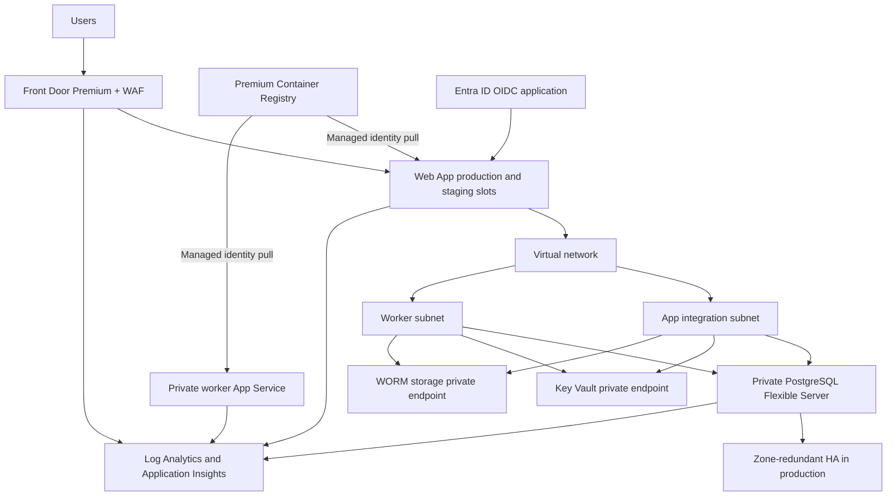

# Internal Tools Foundation — Azure Terraform

**Validated in CI. Not applied. This prototype creates no cloud resources.**

## Topology



## Modules

| Module         | Purpose                                                                            |
| -------------- | ---------------------------------------------------------------------------------- |
| `network`      | Virtual network, delegated subnets, security groups, and private DNS               |
| `postgres`     | Private PostgreSQL Flexible Server, database, Entra administrator, and diagnostics |
| `app_service`  | Web app, staging slot, Front Door ingress restriction, and ACR permissions         |
| `worker`       | Private worker App Service with managed identity                                   |
| `registry`     | Premium Azure Container Registry                                                   |
| `key_vault`    | Private Key Vault, role assignments, and diagnostics                               |
| `monitoring`   | Log Analytics, Application Insights, and action group                              |
| `alerts`       | Web, database, and outbox metric alerts                                            |
| `storage_worm` | Private immutable audit-anchor storage                                             |
| `front_door`   | Front Door Premium, WAF, HTTPS route, and diagnostics                              |
| `identity`     | Entra OIDC application and rotating client secret                                  |

Each environment defines its own backend key and resource settings. The `dev`, `staging`, and `prod` roots use separate state.

## Design decisions

The registry keeps public network access so GitHub-hosted runners can push images. Admin user and anonymous pull remain disabled.
The client can move the registry behind a private endpoint and use self-hosted runners.

- PostgreSQL geo-redundant backup can only be set at server creation. Changing it later replaces the server.
- Each App Service plan integrates with one subnet, so the web app and the worker use separate delegated subnets.
- Each slot has its own managed identity. Check the slot principal name in Entra ID before you create its PostgreSQL role.
- Audit anchors use container-level WORM, so blob versioning stays disabled.
- A locked immutability policy cannot be shortened or removed. Set `immutability_locked` to true only in production.

## Application settings

The web app and the worker set the values that the code reads in `packages/foundation/src/database.ts` and `apps/api/src/server.ts`.

- `PGHOST`, `PGPORT`, `PGDATABASE`, and `PGUSER` select the database. The code gets an Entra access token from the managed identity for each new connection. No database password exists.
- `PGUSER` is the PostgreSQL Entra principal name. For the web app and the worker, it is the app name. For the staging slot, it is `<web app name>/slots/staging`. `PGUSER` is a sticky slot setting, so a swap does not move it.
- `DATABASE_URL` is for local Docker Compose only. If it is set, the code uses it and ignores `PGHOST`.
- With `NODE_ENV=production`, the API, the worker, and the migration script stop at startup if neither `DATABASE_URL` nor `PGHOST` is set.
- `SESSION_SECRET`, `WEBHOOK_SECRET`, and `OIDC_CLIENT_SECRET` are Key Vault references on the web app. `STRIPE_SECRET_KEY` is a Key Vault reference on the worker.
- `OIDC_REDIRECT_URI` is the Front Door callback URL. The Entra application uses the same value.
- `APP_ENV` is the environment name in upper case. The web interface shows it.
- `PORT` and `WEBSITES_PORT` have the same value. The worker opens a health listener on `PORT` and answers `/health/live`.
- App Service health checks use `/health/live`. The Front Door probe uses `/health/ready`, which also checks the database.

## Local validation

Install Terraform 1.16.5, TFLint 0.64.0, and Trivy 0.75.0. TFLint uses the AzureRM ruleset 0.32.0.
Run these commands from `infra/terraform`:

```sh
terraform version
terraform fmt -check -recursive
for env in dev staging prod; do
  terraform -chdir="envs/$env" init -backend=false -input=false
  terraform -chdir="envs/$env" validate
done
tflint --init
tflint --recursive --config "$PWD/.tflint.hcl"
trivy config --severity HIGH,CRITICAL --exit-code 1 .
trivy config .
```

These checks do not create cloud resources. Never run `terraform plan` or `terraform apply` from this prototype workspace.

## State, plan, and apply

1. Bootstrap a dedicated Azure storage account and private state container.
2. Replace backend placeholders in each environment, or pass `-backend-config` values to `terraform init`.
3. Use a separate state key for each environment. Keep state access restricted and enable storage versioning.
4. Run a plan in the pull request pipeline. Review the complete plan before approval.
5. Configure a deployment pipeline with GitHub environment `prod` and required reviewers.
6. Add an OIDC federated credential for the deployment pipeline. Do not store Azure credentials in GitHub secrets.
7. Run apply only from the approved deployment pipeline after manual approval.
8. Run the apply job from a self-hosted runner in the VNet. Key Vault and storage disable public access.

The client owns state storage, access control, recovery, and retention. This repository does not provision or apply the backend.

## Post-apply steps

1. Create the `session-secret`, `webhook-secret`, and `stripe-secret-key` values in Key Vault outside Terraform. If App Service cannot resolve a Key Vault reference, the app gets the reference text, not a secret.
2. Connect to PostgreSQL with an Entra administrator. Create web app, staging slot, and worker principals with `pgaadauth_create_principal`.
3. Run `npm run db:migrate` from a runner in the virtual network. Set `PGHOST`, `PGDATABASE`, and `PGUSER` to an Entra principal that can change the schema. The script uses the same Entra token flow as the app. Then grant the app principals access to the tables.
4. Push the first application image to ACR from an authorized GitHub-hosted runner.
5. Deploy each release to the staging slot. Warm `/health/ready` and check logs before swapping slots.
6. Confirm the production slot serves traffic. Keep the previous slot available for rollback.

The app must emit `outbox_failed_total` for its query alert to detect failed outbox work.

## Client-owned controls

- Provide the Azure subscription, landing zone, network ranges, and resource policies.
- Bootstrap the state storage account and define its access and recovery policies.
- Grant tenant admin consent for the Microsoft Graph permissions.
- Own DNS, the custom domain, and TLS certificates when configured.
- Maintain action group recipients and on-call coverage.
- Review service cost and capacity. Run PostgreSQL backup restore drills.
- Own secret rotation operations and review the Terraform state exposure risk.

## Security controls

| Control                     | Implementation                                                                 | File                                                                                    |
| --------------------------- | ------------------------------------------------------------------------------ | --------------------------------------------------------------------------------------- |
| Private database            | Delegated subnet, disabled public access, and explicit NSG rules               | `modules/postgres/main.tf`, `modules/network/main.tf`                                   |
| Point-in-time recovery      | 35-day backup retention and geo-redundant backup                               | `modules/postgres/main.tf`                                                              |
| High availability           | Zone-redundant PostgreSQL only in production                                   | `envs/prod/main.tf`, `modules/postgres/main.tf`                                         |
| WORM audit anchors          | 30-day deletion recovery, immutable container, seven-year production retention | `modules/storage_worm/main.tf`                                                          |
| Web application firewall    | Front Door Premium managed rules and request rate limiting                     | `modules/front_door/main.tf`                                                            |
| Secret storage              | Private Key Vault, RBAC, and Key Vault references                              | `modules/key_vault/main.tf`, `modules/app_service/main.tf`                              |
| Managed identities          | ACR pull role assignments; no registry admin credentials                       | `modules/app_service/main.tf`, `modules/worker/main.tf`, `modules/registry/main.tf`     |
| Zero-downtime release       | Staging slot and documented warm-up and swap process                           | `modules/app_service/main.tf`                                                           |
| TLS 1.2                     | Web and worker minimum TLS, storage minimum TLS, HTTPS ingress                 | `modules/app_service/main.tf`, `modules/worker/main.tf`, `modules/storage_worm/main.tf` |
| Centralized logs and alerts | Diagnostic settings, Log Analytics, App Insights, and alerts                   | `modules/monitoring/main.tf`, `modules/alerts/main.tf`                                  |
| Entra SSO                   | OIDC app, group claims, and single-tenant audience                             | `modules/identity/main.tf`                                                              |

## Scanner exceptions

| Finding    | Reason                                                                                                     | File                                                    |
| ---------- | ---------------------------------------------------------------------------------------------------------- | ------------------------------------------------------- |
| `AZU-0001` | Front Door restricts web ingress. The worker is private and has no client-facing endpoint.                 | `modules/app_service/main.tf`, `modules/worker/main.tf` |
| `AZU-0003` | The Node service owns OIDC. App Service authentication would duplicate it. The worker is not user-facing.  | `modules/app_service/main.tf`, `modules/worker/main.tf` |
| `AZU-0017` | The Key Vault secret expiry comes from the rotating Entra password. Trivy cannot evaluate that expression. | `modules/identity/main.tf`                              |
| `AZU-0057` | Blob diagnostics use a separate diagnostic setting. The scanner checks account-level properties.           | `modules/storage_worm/main.tf`                          |
| `AZU-0058` | Development and staging use required ZRS replication. Production uses GZRS.                                | `modules/storage_worm/main.tf`                          |
| `AZU-0060` | This prototype uses platform-managed keys. The client owns future CMK provisioning and rotation.           | `modules/storage_worm/main.tf`                          |

This table records the reason for each inline Trivy directive.
